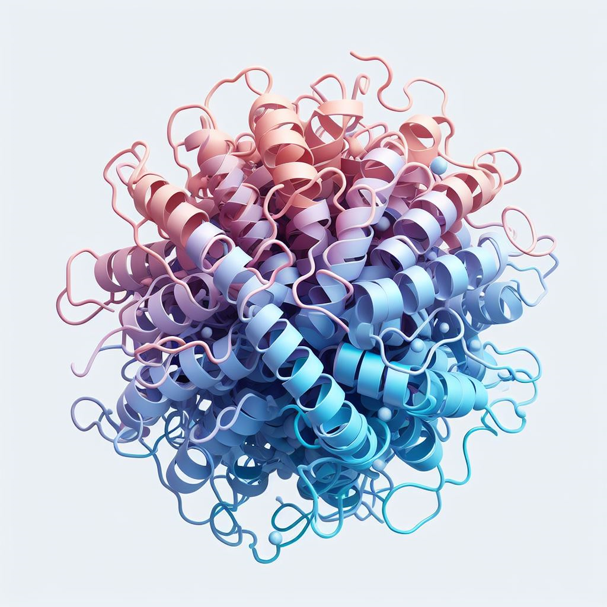
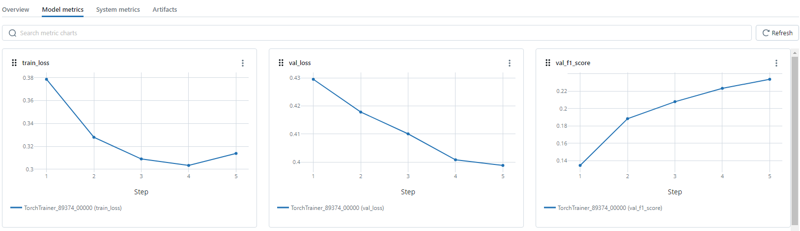

<!-- Improved compatibility of back to top link: See: https://github.com/othneildrew/Best-README-Template/pull/73 -->
<a name="readme-top"></a>
<!--
*** Thanks for checking out the Best-README-Template. If you have a suggestion
*** that would make this better, please fork the repo and create a pull request
*** or simply open an issue with the tag "enhancement".
*** Don't forget to give the project a star!
*** Thanks again! Now go create something AMAZING! :D
-->


<!-- PROJECT SHIELDS -->
<!--
*** I'm using markdown "reference style" links for readability.
*** Reference links are enclosed in brackets [ ] instead of parentheses ( ).
*** See the bottom of this document for the declaration of the reference variables
*** for contributors-url, forks-url, etc. This is an optional, concise syntax you may use.
*** https://www.markdownguide.org/basic-syntax/#reference-style-links
-->


<!-- PROJECT LOGO -->
<br />
<div align="center">
  <a href="https://github.com/naity/finetune-esm">
    
  </a>
 
<h3 align="center">Finetune-ESM</h3>

  <p align="center">
    Scalable Protein Language Model Finetuning with Distributed Learning and Advanced Training Techniques such as LoRA.
    <br />
    <br />
    <br />
    <a href="https://github.com/naity/finetune-esm/issues">Report Bug</a>
    ·
    <a href="https://github.com/naity/finetune-esm/issues">Request Feature</a>
  </p>
</div>


<!-- TABLE OF CONTENTS -->
<details>
  <summary>Table of Contents</summary>
  <ol>
    <li>
      <a href="#about-the-project">About The Project</a>
      <ul>
        <li><a href="#built-with">Built With</a></li>
      </ul>
    </li>
    <li>
      <a href="#getting-started">Getting Started</a>
      <ul>
        <li><a href="#prerequisites">Prerequisites</a></li>
      </ul>
    </li>
    <li><a href="#usage">Usage</a></li>
    <li><a href="#roadmap">Roadmap</a></li>
    <li><a href="#contributing">Contributing</a></li>
    <li><a href="#license">License</a></li>
    <li><a href="#contact">Contact</a></li>
    <li><a href="#acknowledgments">Acknowledgments</a></li>
  </ol>
</details>


<!-- ABOUT THE PROJECT -->
## About The Project

This project explores scalable and efficient finetuning of protein language models like ESM-2 using advanced training techniques like FSDP (Fully Sharded Data Parallel) and LoRA (Low-Rank Adaptation).

**Highlights**

* **Distributed training**: Leverage distributed computing for finetuning large protein language models on multiple GPUs.
* **Advanced techniques**: Explore LoRA and other methods to improve finetuning efficiency and performance.
* **Reproducibility**: Track and manage finetuning experiments using tools like MLflow.

<p align="right">(<a href="#readme-top">back to top</a>)</p>


### Built With

* [![Python][Python_badge]][Python-url]
* [![Pytorch][Pytorch_badge]][Pytorch-url]
* [![ESM][ESM_badge]][ESM-url]
* [![Lightning][Lightning_badge]][Lightning-url]
* [![Ray][Ray_badge]][Ray-url]
* [![MLflow][MLflow_badge]][MLflow-url]
* [![Transformers][Transformers_badge]][Transformers-url]

<p align="right">(<a href="#readme-top">back to top</a>)</p>


<!-- GETTING STARTED -->
## Getting Started

1. Clone the repo:
```sh
git clone https://github.com/naity/finetune-esm.git
```

2. Run the `train.py` script to see a list of available parameters:
```sh
python finetune-esm/train.py --help
```

### Prerequisites

The `requirements.txt` file lists the Python packages that need to be installed in order to run the scripts. Please use the command below for installation.
  ```sh
  pip install -r requirements.txt
  ```

<p align="right">(<a href="#readme-top">back to top</a>)</p>


<!-- USAGE EXAMPLES -->
## Usage
In this example, we will finetune ESM-2 for the [CAFA 5 Protein Function Prediction Challenge](https://www.kaggle.com/competitions/cafa-5-protein-function-prediction) to predict the biological function of a protein based on its primary sequence.
I have already preprocessed the data and formatted the problem as a multi-class, multi-label problem. This means that for a given protein sequence, we will predict whether it is positive for each of the 100 preselected Gene Ontology (GO) terms. Thus, the target for each protein sequence is a binary vector with a length of 100.

The processed datasets can be downloaded from [here](https://drive.google.com/drive/folders/1AV46AaOHDn_2lR65R8PIBJKXgz6Xk204?usp=sharing). Details about the preprocessing steps can be found in the `notebooks/cafa5_data_processing.ipynb` notebook.

Run the following example command to finetune ESM-2 models with the processed datasets. Here, we are using the smallest model `esm2_t6_8M_UR50D` with 1 GPU and the LoRA approach. If you want to finetune a larger model and have multiple GPUs, please adjust `num_workers` and/or `num-devices` accordingly.
```
python finetune_esm/train.py \
  --experiment-name esm2_t6_8M_UR50D_lora \
  --dataset-loc data/cafa5/top100_train_split.parquet \
  --targets-loc data/cafa5/train_bp_top100_targets.npy \
  --esm-model esm2_t6_8M_UR50D \
  --num-workers 1 \
  --num-devices 1 \
  --training-mode lora \
  --learning-rate 0.0001 \
  --num-epochs 5
```

Once training is done, we can use MLflow to view the experiment using:

`mlflow server --host 127.0.0.1 --port 8080 --backend-store-uri ./finetune_results/mlflow`

Below are screenshots of the example experiment. We can view parameters, artifacts, and visualize the metrics results.




<p align="right">(<a href="#readme-top">back to top</a>)</p>


<!-- ROADMAP -->
## Roadmap

- [x] Data Processing
- [x] Training
- [ ] Serving

See the [open issues](https://github.com/naity/finetune-esm/issues) for a full list of proposed features (and known issues).

<p align="right">(<a href="#readme-top">back to top</a>)</p>


<!-- CONTRIBUTING -->
## Contributing

Contributions are what make the open source community such an amazing place to learn, inspire, and create. Any contributions you make are **greatly appreciated**.

If you have a suggestion that would make this better, please fork the repo and create a pull request. You can also simply open an issue with the tag "enhancement".
Don't forget to give the project a star! Thanks again!

1. Fork the Project
2. Create your Feature Branch (`git checkout -b feature/AmazingFeature`)
3. Commit your Changes (`git commit -m 'Add some AmazingFeature'`)
4. Push to the Branch (`git push origin feature/AmazingFeature`)
5. Open a Pull Request

<p align="right">(<a href="#readme-top">back to top</a>)</p>


<!-- LICENSE -->
## License

Distributed under the MIT License. See `LICENSE.txt` for more information.

<p align="right">(<a href="#readme-top">back to top</a>)</p>


<!-- CONTACT -->
## Contact

<p align="left">
<a href="https://linkedin.com/in/ytiancompbio" target="blank"></a>
<a href="https://twitter.com/ytiancompbio" target="blank"></a>
<a href="https://medium.com/@yuan_tian" target="blank"></a>
<a href="https://www.youtube.com/c/ytiancompbio" target="blank"></a>
</p>

<p align="right">(<a href="#readme-top">back to top</a>)</p>


<!-- ACKNOWLEDGMENTS -->
## Acknowledgments

* [Made With ML](https://madewithml.com/)

<p align="right">(<a href="#readme-top">back to top</a>)</p>


<!-- MARKDOWN LINKS & IMAGES -->
<!-- https://www.markdownguide.org/basic-syntax/#reference-style-links -->
[product-screenshot]: images/screenshot.png
[Python_badge]: https://img.shields.io/badge/Python-3776AB?logo=python&logoColor=fff&style=flat
[Python-url]: https://www.python.org/
[Pytorch_badge]: https://img.shields.io/badge/PyTorch-EE4C2C?logo=pytorch&logoColor=fff&style=flat
[Pytorch-url]: https://pytorch.org/
[Lightning_badge]: https://img.shields.io/badge/Lightning-792EE5?logo=lightning&logoColor=fff&style=flat
[Lightning-url]: https://lightning.ai/docs/pytorch/stable/
[Ray_badge]: https://img.shields.io/badge/Ray-028CF0?logo=ray&logoColor=fff&style=flat
[Ray-url]: https://www.ray.io/
[Transformers_badge]: https://img.shields.io/badge/%F0%9F%A4%97-Transformers-yellow?style=for-the-badge&style=flat
[Transformers-url]: https://huggingface.co/docs/transformers/index
[ESM_badge]: https://img.shields.io/badge/ESM-blue?style=for-the-badge&style=flat
[ESM-url]: https://github.com/facebookresearch/esm/
[MLflow_badge]: https://img.shields.io/badge/MLflow-0194E2?logo=mlflow&logoColor=fff&style=flat
[MLflow-url]: https://mlflow.org/
